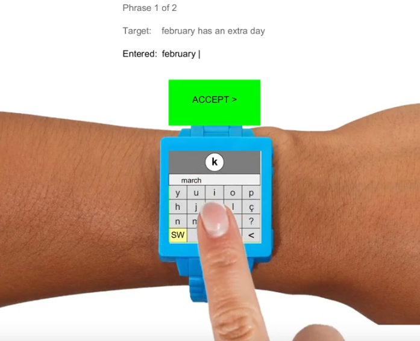

# SmartWatch Keyboard Project - HCI IST 2020

## Description 
SmartKeyboard Concept implemented in Processing 3 for the discipline of Human-Computer Interactions at Instituto Superior Técnico. 

## Objective
The objective of this project was to implement a smartwatch keyboard that prioritizes user speed at texting. In order to implent this we used a split QWERTY keyboard concept and predictive text;

## How to Use
In order to use experiment it run it you need the processing application available at here(https://processing.org/download/) , we recomend you use the 3.5 version.

